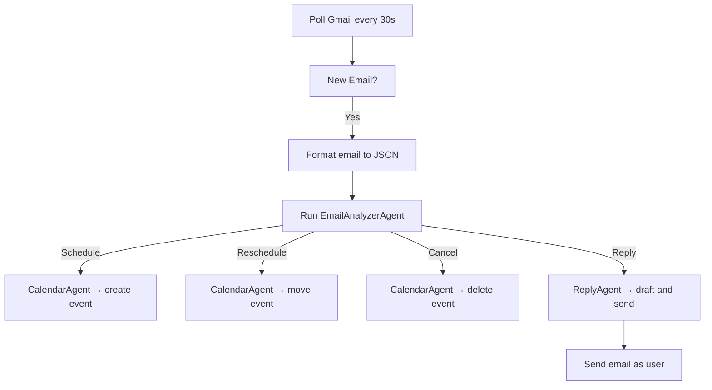

# 📘 Fraya PRD – AI Executive Assistant

## 🧠 Overview

Fraya is an AI executive assistant that autonomously manages Gmail and Google Calendar on the user’s behalf. It can read, understand, and respond to emails; book, reschedule, and cancel meetings; and adapts its tone and behavior based on user preferences. It uses CrewAI to coordinate multiple AI agents to accomplish these tasks.

---

## 🧰 Tech Stack

| Layer      | Technology                                   |
| ---------- | -------------------------------------------- |
| Frontend   | Next.js, Tailwind CSS, shadcn/ui             |
| Backend    | Django (Python), Celery (optional for async) |
| AI Engine  | OpenAI + CrewAI framework                    |
| DB         | Supabase (Postgres)                          |
| Auth       | Google OAuth via Supabase & Google SDK       |
| Email/Cal  | Gmail API, Google Calendar API               |
| Local Dev  | ngrok (for testing webhooks/Google Auth)     |
| Deployment | Windsurf (Django) + Vercel (Next.js)         |
| VCS        | GitHub                                       |

---

## 🗂 Project Structure

```plaintext
fraya/
│
├── apps/
│   ├── web/                        # Next.js frontend
│   ├── api/                        # Django backend
│
├── packages/
│   ├── agents/                     # CrewAI agents: email, calendar, reply
│   ├── prompts/                   # Prompt templates (tone, behavior, task goals)
│   ├── services/                  # Gmail + Calendar integrations
│   ├── utils/                     # Shared helpers: formatting, auth, time logic
│
├── supabase/
│   ├── migrations/
│   ├── seed/
│
├── infra/
│   ├── scripts/
│   ├── ngrok.sh
│   └── vercel.json
│
├── .env.local
└── README.md
```

---

## 🧩 Module Responsibilities

### 📱 Frontend (Next.js – `apps/web/`)

| Page                 | Description                                                |
| -------------------- | ---------------------------------------------------------- |
| `/`                  | Homepage with CTA to connect Google account                |
| `/login` / `/signup` | Auth via Supabase                                          |
| `/dashboard`         | Stats: meetings booked, upcoming meeting, Fraya activity   |
| `/settings`          | User preferences form (tone, buffer, preferred days/times) |
| `/auth/callback`     | Handles Google OAuth callback                              |

**Libraries**:

* shadcn/ui for form controls and layout
* Tailwind CSS for styling
* Supabase Auth client for login/session

**State**:

* Supabase session stored via context
* Local component state for preferences/settings

---

### ⚙️ Backend (Django – `apps/api/`)

* `/api/emails/poll/`: Polls Gmail inbox for new messages (every 30s)
* `/api/email/analyze/`: Sends email JSON to CrewAI agent
* `/api/calendar/schedule/`: Creates/reschedules events
* `/api/calendar/delete/`: Deletes event
* `/api/user/preferences/`: Updates preferences
* `/api/send-email/`: Sends email using user’s Gmail credentials

---

### 🤖 AI Agent Architecture (CrewAI – `packages/agents/`)

#### Agents:

* `FrayaCoreAgent`: Oversees all decisions and delegates to other agents
* `EmailAnalyzerAgent`: Determines intent from incoming email (schedule, reschedule, reply, ignore)
* `CalendarAgent`: Finds/schedules/deletes meetings via Google Calendar API
* `ReplyAgent`: Drafts contextual replies based on user tone/style

**Prompt Format** (stored in `packages/prompts/`):

```json
{
  "backstory": "Fraya is an executive assistant who manages calendar & email intelligently...",
  "user_preferences": {
    "tone": "professional",
    "style": "concise",
    "meeting_days": ["Monday", "Tuesday"],
    "buffer": 15
  },
  "email_example": {
    "from": "...",
    "to": "...",
    "subject": "...",
    "body": "..."
  }
}
```

---

## 🧠 User Preferences (Supabase Schema)

```sql
-- Users
users (
  id UUID PRIMARY KEY,
  email TEXT,
  google_refresh_token TEXT,
  created_at TIMESTAMP
)

-- Preferences
preferences (
  id UUID PRIMARY KEY,
  user_id UUID REFERENCES users(id),
  preferred_days TEXT[],        -- ['Monday', 'Tuesday']
  preferred_times TEXT[],       -- ['09:00-11:00', '14:00-17:00']
  buffer_minutes INTEGER,       -- e.g., 15
  tone TEXT,                    -- 'friendly', 'professional', 'humorous'
  style TEXT,                   -- 'concise', 'detailed'
  created_at TIMESTAMP,
  updated_at TIMESTAMP
)
```

---

## 🔁 Fraya Workflow

### Gmail Polling + Execution Flow



### Email Format (to terminal and agent)

```json
{
  "from": "example@example.com",
  "to": "jamahl@sociimoney.com",
  "subject": "Reschedule meeting",
  "cc": ["other@example.com"],
  "body": "Hey Jamahl, can we move our meeting?",
  "timestamp": "2025-05-31T14:22:00Z"
}
```

---

## 📬 Gmail + Calendar Services (`packages/services/`)

* `gmail.py`

  * `get_unread_emails()`
  * `send_email(from_email, to, subject, body)`
  * `format_email_json(raw_email)`

* `calendar.py`

  * `find_available_slots(user_prefs)`
  * `schedule_event(details)`
  * `reschedule_event(event_id, new_time)`
  * `delete_event(event_id)`

* `auth.py`

  * Handles token refresh, stores in Supabase

---

## 🧪 Local Dev

1. Run ngrok:

```bash
ngrok http 8000
```

2. Point Gmail webhook (or simulator) to:

```
https://<ngrok-url>/api/emails/poll/
```

---

## 📊 Dashboard Features (`/dashboard`)

* Total meetings booked
* Next meeting summary
* Recent email replies
* Preferences summary
* Button to re-sync Google Account

---

## 🔐 Secrets Required

```env
GOOGLE_CLIENT_ID=
GOOGLE_CLIENT_SECRET=
OPENAI_API_KEY=
SUPABASE_URL=
SUPABASE_SERVICE_KEY=
```

---

## ✅ Actionable TODOs

| Task                                   | Description |
| -------------------------------------- | ----------- |
| \[ ] Supabase schema setup             |             |
| \[ ] Build Gmail + Calendar service    |             |
| \[ ] Implement CrewAI agents           |             |
| \[ ] Create prompt templates           |             |
| \[ ] Setup Django endpoints            |             |
| \[ ] Build Next.js dashboard/settings  |             |
| \[ ] Configure OAuth + test with ngrok |             |
